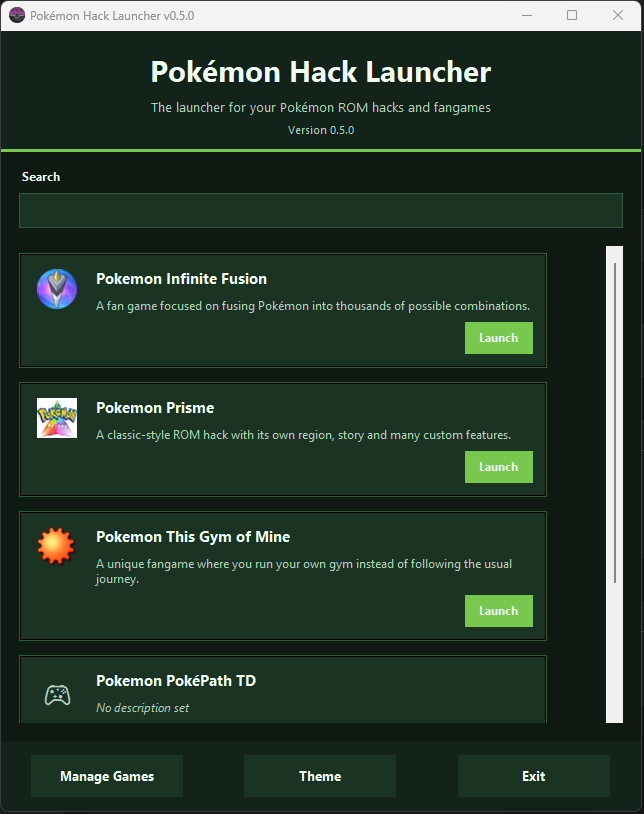
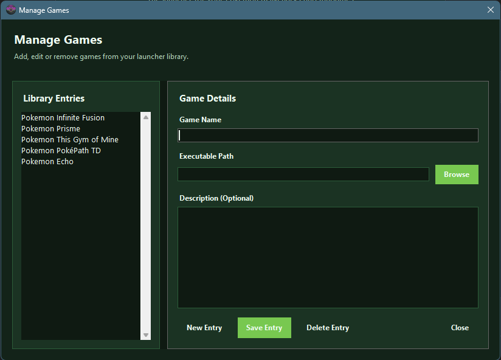
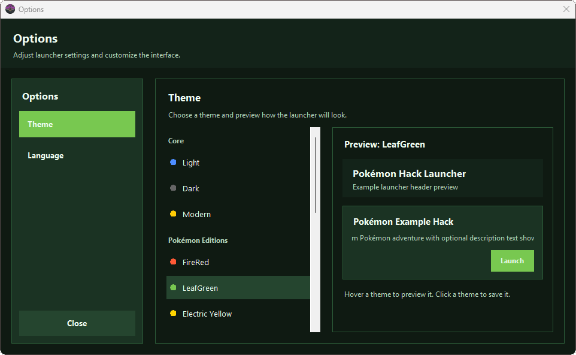
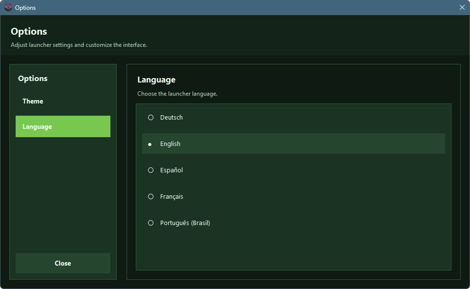

<p align="center">
  
</p>

<h1 align="center">Pokémon Hack Launcher</h1>

<p align="center">
  
  
  
  
</p>

<p align="center">
A simple, clean launcher to organize and start your **Pokémon ROM hacks and fangames**.

The launcher allows players to organize their ROM hacks, quickly launch them, and track favorites or recently played games.

This project is designed to be simple, fast, and fully local.
</p>

<p align="center">
⬇ <b>Download the latest version</b><br>
<a href="https://github.com/Barath0n/Pokemon-Hack-Launcher/releases/latest">
https://github.com/Barath0n/Pokemon-Hack-Launcher/releases/latest
</a>
</p>

---

# Screenshots

### Main Launcher


The main launcher shows your ROM hack library with icons, descriptions, and quick launch buttons.

You can:

- Search your games
- Filter by favorites
- Filter by recently played
- Launch games directly

---

### Manage Games


The **Manage Games** window allows you to:

- Add new game entries
- Edit existing entries
- Set executable paths
- Add descriptions
- Delete entries

All changes are automatically saved to your local library.

---

### Options – Themes


Customize the launcher appearance with multiple Pokémon-inspired themes.

Examples include:

- Light
- Dark
- Modern
- FireRed
- LeafGreen
- Electric Yellow
- Emerald
- Lavender Town
- Ultra

Themes can be previewed instantly before applying them.

---

### Options – Language


The launcher supports multiple languages.

Currently supported:

- English
- Deutsch
- Español
- Français
- Português (Brasil)

Language changes apply instantly.

---

# Features

### Game Library

Organize all your Pokémon ROM hacks and fangames in one place.

Each entry supports:

- Game title
- Description
- Icon
- Launch path
- Favorite status
- Last played tracking

---

### Favorites System

Mark your favorite hacks using the ⭐ icon.

Use the **Favorites filter** to quickly access them.

---

### Recently Played

The launcher automatically records when a game was last started.

Use the **Recently Played** filter to quickly return to your latest games.

---

### Search

Instantly search your library by:

- Game title
- Description

Results update in real time.

---

### Game Manager

Easily manage your library using the **Manage Games** window.

You can:

- Create new entries
- Update existing entries
- Remove games
- Automatically save your library

---

### Themes

Customize the look of the launcher with Pokémon-inspired color themes.

Themes can be changed in the **Options menu**.

---

### Multi-Language Support

Switch the launcher language at any time.

Languages are stored in simple translation files and can easily be extended.

---

# Installation

No installation required.

Download the latest release and run:

launcher.exe

---

# Data Storage

The launcher stores all data locally using JSON files.

```
games.json
settings.json
themes.json
```

No internet connection is required.


# Project Structure


```
core/
ui/
translations/
launcher.py
games.json
themes.json
settings.json
```

---

# Roadmap

Planned future improvements:

- Game sorting options
- Optional playtime tracking
- Emulator auto-launch support
- Optional hack database integration
- UI polish and animations
- Additional themes

---

# Contributing

Contributions and suggestions are welcome.

If you find a bug or have a feature idea, feel free to open an issue.

---

# Disclaimer

This project is a **fan-made tool** and is not affiliated with Nintendo, Game Freak, or The Pokémon Company.

All Pokémon names, assets, and trademarks belong to their respective owners.

---

# License

This project is released under the **MIT License**.

See `LICENSE` for details.

Please respect the original creators of the Pokémon fan games you add to the launcher.
